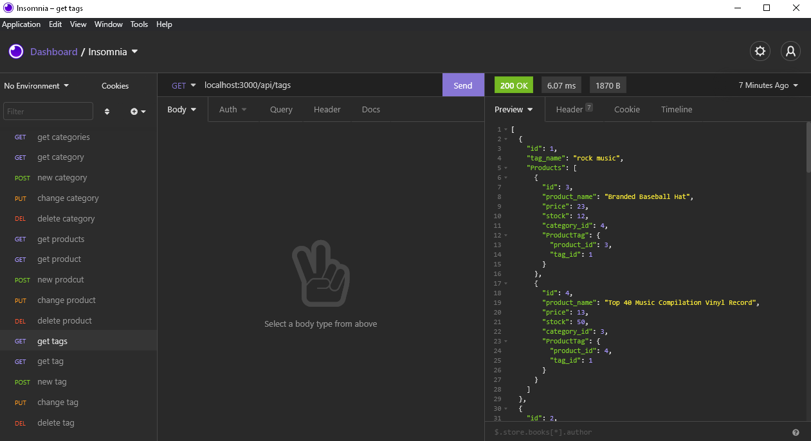
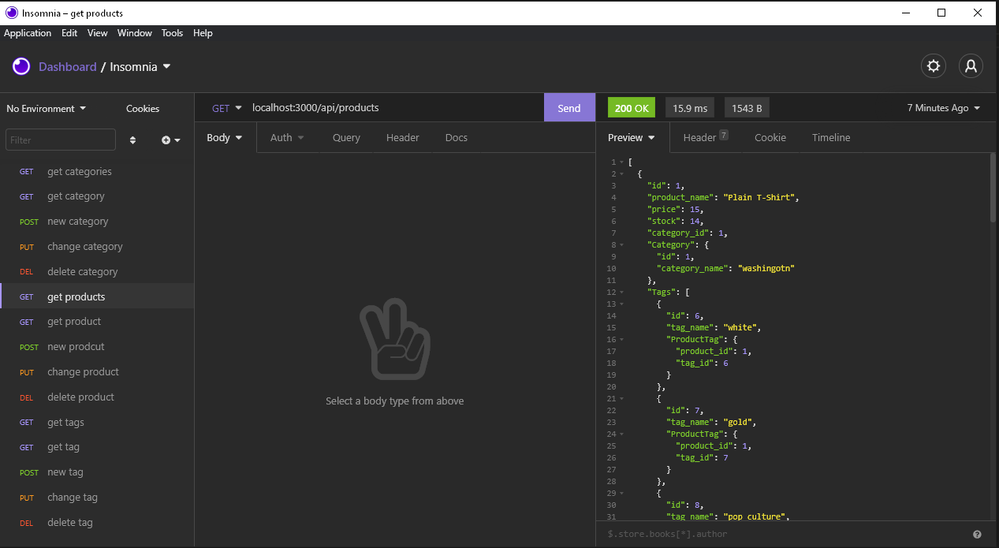
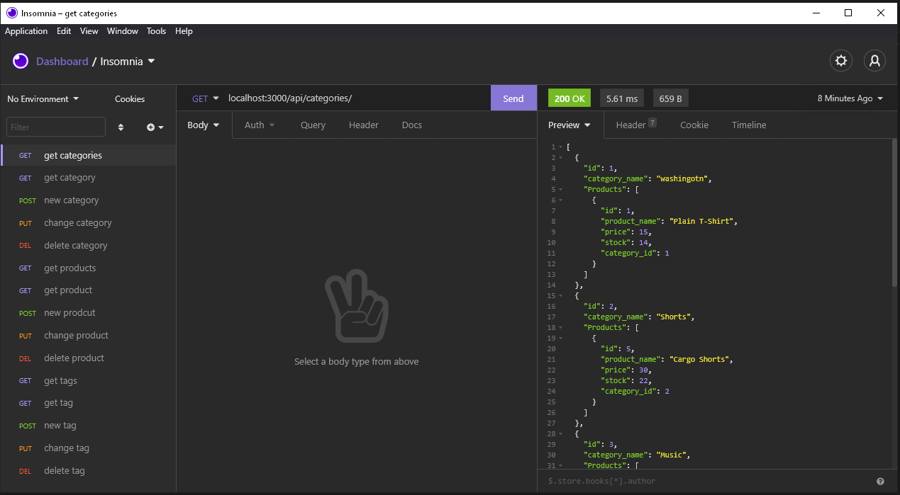

# E-Commerce Back End

Demonstration of application in action <a href="https://youtu.be/amHtpHVLdJ4">here</a>.

## Table of Contents

- [Installation](#installation)
- [Instructions](#instructions)
- [Questions](#questions)
- [License](#license)

## Description:

The purpose of this project is to build a back-end for inventory management of a commerce operation.There is full CRUD functionality for handling products, categories, and product tags.

## Installation

1. Clone the repository to your local machine
2. Run `npm i` to install dependencies

## Instructions

1. Navigate to `schema.sql` and open it in terminal
2. Log into MYSQL and run `source schema.sql` to create the database
3. Go back to `server.js` in your terminal and run `npm run seed` to seed the database
4. In your terminal run `npm start` to initialized the server
5. In either Insomnia or your browser you can now access all the routes

## Quesions

If you have any questions, contact me <a href="https://github.com/TheHebi" target="_blank">here</a>, or send me an email at nturcotte8@live.com.

## License

This project uses the MIT License
